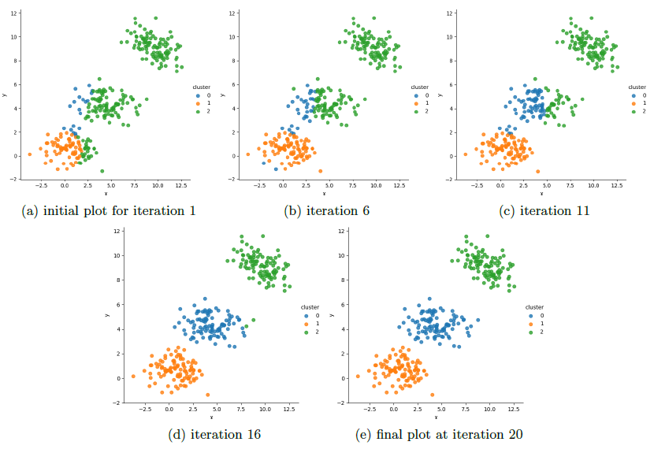

Expectation-Maximization (EM) approach is one of the most popular methods used in semi-supervised and unsupervised clustering. Given training data, it iteratively estimates maximum likelihood in order
to learn the parameters governing a distribution. There are two main steps of this approach which are expectation step and maximization step.

A Gaussian Mixture Model (GMM) is a parametric probability density function represented as a weighted sum of K multivariate Gaussian densities where K is the number of clusters. K=3 for this project.

In this project, we investigate the implementation of an Expectation-Maximization algorithm for Gaussian Mixture Model. The aim is to estimate the GMM parameters that maximize log probability of data by using the iterative EM algorithm.

EM is an iterative approach. It starts with some initial parameters and then, algorithm updates these parameters until the convergence. 

## EMforGMM.py
        
Run EMforGMM.py in a Python IDE or the terminal by typing: ```python EMforGMM.py```

### An example of output is as follow:

```
Initial Values:
means =  [[0.45578935625346617, 0.2613001755748112], [0.4922175345607438, 0.6418972791325753], [0.5853986986920222, 0.36913857368425707]]
covariances =  [[[1.0, 0.0], [0.0, 1.0]], [[1.0, 0.0], [0.0, 1.0]], [[1.0, 0.0], [0.0, 1.0]]]
mixing_coefficients:  [0.33333333 0.33333333 0.33333333]
Iteration:  0  - Log likelihood value:  -1418.6383408305494
Iteration:  1  - Log likelihood value:  -1412.8047855083823
Iteration:  2  - Log likelihood value:  -1407.2896901189335
Iteration:  3  - Log likelihood value:  -1401.104146226602
Iteration:  4  - Log likelihood value:  -1393.0104350645747
Iteration:  5  - Log likelihood value:  -1381.2861154018196
Iteration:  6  - Log likelihood value:  -1370.428525612007
Iteration:  7  - Log likelihood value:  -1367.702370332164
Iteration:  8  - Log likelihood value:  -1367.1468235124075
Iteration:  9  - Log likelihood value:  -1366.7681657172868
Iteration:  10  - Log likelihood value:  -1366.4153970761834
Iteration:  11  - Log likelihood value:  -1366.0706643622043
Iteration:  12  - Log likelihood value:  -1365.7177975879154
Iteration:  13  - Log likelihood value:  -1365.331603844515
Iteration:  14  - Log likelihood value:  -1364.8714494909623
Iteration:  15  - Log likelihood value:  -1364.267624935605
Iteration:  16  - Log likelihood value:  -1363.3909414589298
Iteration:  17  - Log likelihood value:  -1361.9873795060794
Iteration:  18  - Log likelihood value:  -1359.559402368162
Iteration:  19  - Log likelihood value:  -1355.2716446937447
Iteration:  20  - Log likelihood value:  -1348.0190080709322
Iteration:  21  - Log likelihood value:  -1335.385668615998
Iteration:  22  - Log likelihood value:  -1313.5800963456652
Iteration:  23  - Log likelihood value:  -1278.468746060887
Iteration:  24  - Log likelihood value:  -1236.61179753569
Iteration:  25  - Log likelihood value:  -1231.693379805821
Iteration:  26  - Log likelihood value:  -1231.6888318816236
Final Values:
means =  [[0.70190559 0.66098685]
 [9.60515914 9.16835946]
 [4.3785268  4.35151428]]
covariances =  [[[ 2.11807916 -0.10013924]
  [-0.10013924  0.64017684]]

 [[ 2.01245138 -0.64166751]
  [-0.64166751  0.82171148]]

 [[ 2.74893229 -0.11828091]
  [-0.11828091  0.6185444 ]]]
mixing_coefficients:  [0.33310209 0.33333331 0.3335646 ]
```

And the final clusters' generated figure is as follows
<p align="center"></p>


## Results of different experiements

Clustering results at different iterations
<p align="center"></p>

Clustering results using two or three similar mean values (im: initial means)
<p align="center"></p>

Clustering results using different mixing coefficients (mc: initial mixing coefficients)
<p align="center"></p>

## References

N. Singh and D. Singh, "Performance evaluation of k-means and heirarichal clustering in terms of accuracy and running time," IJCSIT) International Journal of Computer Science and Information Technologies, vol. 3, no. 3, pp. 4119-4121, 2012.

Rui Xu and D.Wunsch, "Survey of clustering algorithms," IEEE Transactions on Neural Networks, vol. 16, no. 3, pp. 645-678, 2005.

G. Ahalya and H. M. Pandey, "Data clustering approaches survey and analysis," in 2015 International Conference on Futuristic Trends on Computational Analysis and Knowledge Management(ABLAZE), pp. 532-537, 2015.

T. K. Moon, "The expectation-maximization algorithm," IEEE Signal processing magazine, vol. 13, no. 6, pp. 47-60, 1996.

D. A. Reynolds, "Gaussian mixture models.," Encyclopedia of biometrics, vol. 741, 2009.

C. B. Do and S. Batzoglou, "What is the expectation maximization algorithm?," Nature biotechnology, vol. 26, no. 8, pp. 897-899, 2008.

"7 ways to label a cluster plot in python | nikki marinsek." https://nikkimarinsek.com/blog/7-ways-to-label-a-cluster-plot-python. (Accessed on 01/01/2021).

C. Biernacki, G. Celeux, and G. Govaert, "Choosing starting values for the em algorithm for getting the highest likelihood in multivariate gaussian mixture models," Computational Statistics & Data Analysis, vol. 41, no. 3-4, pp. 561-575, 2003.

##### This project was implemented for CmpE 544 Pattern Recognition Course of Bogazici University.
